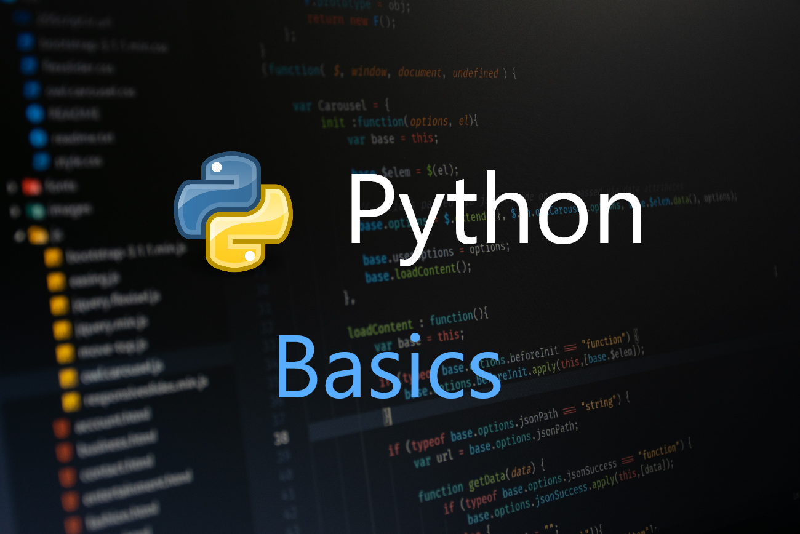

# Python Basics: Bucles, Funciones y Listas

## Bucles For
Los bucles `for` nos permiten iterar sobre elementos en estructuras de datos de Python. La sintaxis básica es:

for ELEMENTO in SECUENCIA:

### Ejemplos:
- Iterando sobre una cadena de texto.
- Iterando sobre una lista.
- Usando un filtro `if` dentro del bucle.
- Usando `break` para detener el bucle.
- Usando `pass` para continuar sin hacer nada.
- Determinando si un número es par.
- Usando la función `range()` para generar secuencias de números.
- Usando `enumerate()` para obtener el índice y el valor de una lista.
- Usando `reversed()` para iterar una lista en orden inverso.
- Usando `in` para buscar elementos en una lista.
- Anidando bucles `for`.
- Trabajando con diccionarios.

## Bucles While
Los bucles `while` se ejecutan mientras una condición sea verdadera.

### Ejemplos:
- Usando un bucle `while` simple.
- Usando `break` para salir de un bucle `while`.
- Usando `continue` para saltar a la siguiente iteración del bucle.
- Usando `while True` para bucles que se ejecutan indefinidamente.

## Funciones
Las funciones nos permiten encapsular y reutilizar código. Se definen con la palabra clave `def`.

### Ejemplos:
- Definiendo una función para sumar dos números.
- Definiendo una función con múltiples valores de retorno.
- Documentando funciones con docstrings.
- Pasando argumentos a funciones y estableciendo valores predeterminados.
- Usando `*args` para pasar un número variable de argumentos.

## Funciones Lambda
Las funciones lambda son funciones anónimas de una sola expresión. Se definen con la palabra clave `lambda`.

### Ejemplos:
- Definiendo funciones lambda simples.
- Usando funciones lambda con `filter()`.

## Listas por Comprensión
Las listas por comprensión proporcionan una forma concisa de crear listas.

### Ejemplos:
- Creando listas usando bucles `for` dentro de corchetes.
- Filtrando elementos en listas por comprensión.
